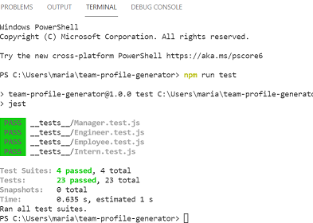

# team-profile-generator

## Description 

Full-Stack Application using Inquirer to form CLI questions and Jest for testing purposes.This project required building a Node.js command-line application that takes in information about employees and generates an HTML webpage that displays summaries for each person. Tests were written for each part of the code using Jest to ensure that it passes all of them.

## Table of Contents
* [Description](#description)
* [Application](#application)
* [Technologies](#technologies)
* [GitHub Repository](#Github)
* [GitHub Deployed](#GithubDeployed)
* [Walkthrough Video](#Walkthrough)
* [Application](#gif)

## Technologies 

* HTML
* CSS
* JavaScript
* Node.js
* Inquirer
* Jest

## GitHub Repository

* [Team Profile Generator GitHub Repository ](https://github.com/mhdavie/team-profile-generator)

## Walkthrough Video

* [Team Profile Generator Video](https://watch.screencastify.com/v/dMJDhifUGRUDaWONVNQr)

## Application 

## Screenshots

